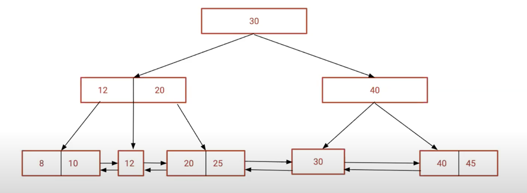

    DB Index

* helps in
  
    -> improving performance of queries
  
    -> reducing disk i/o operation on disk
  
    -> sorting
  
    -> uniqueness of data

* Cons:
  
  -> disc space to store the index
  
  -> write query becomes costly | i.e. i need to add data to main table + taking care of index 
  
  -> a bad index can cause more harm than good

    
    DS used in index
    
* B-treee -> default index
* hash index -> for equality operators | or when we know coln value is going to be unique 
* gin index -> for composite datatypes like json
* brin -> when we know we want to work on range of values

    
    B-tree for indexing

* Read operation needs to be fast 
* now with this ds -> searching is faster
* and if data has to be read -> all last leaf nodes can sequentially be traversed bcoz of pointers maintained shown in fig.

    explain analyze -> in postgress 
     -> good way to analyse -> time taken by query | # of rows scanned | which index is used 

    
    

    