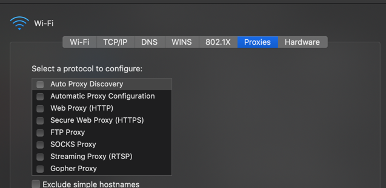

Proxy -- vs -- Reverse Proxy

Proxy

    Client 1   --
    Client 2   --   Proxy   --   Server 
    Client 3   --

    

    -> hides identity of the client to the server
    -> benefits : 
        -> anonimity
        -> caching can be kept in proxy 
        -> blocking unwanted sites [ur ISP will most likely compy to govt] 
        -> GeoFencing -> certain clients are accessing on certain servers [Killing democracy :P ]
        -> side-car proxies with microservices -> like http , tcp , linkerd proxy
    When u want to call somebody -> u are calling through somebody else.
    One server acting on the behalf of another computer.
    Forward proxy -> Generally abstracts out a group of client with in an internal network and sends outgoing request via this proxy server
    Organisation blocking their employees form using social
    Generally protects the clients

Reverse Proxy

                            --   Server 1
    Client   --   Proxy     --   Server 2 
                            --   Server 2 

    
    -> Client doent know who the final destination server is
    -> typiccaly when it is connecting to an application
    -> benefits :
        -> Load balancing [hit servers in round robin ..etc]
        -> ingress - in k8s world -> 
            like a router
            - /comments -> comments service  
            - /accounts -> accounts service  
        -> caching [if request is idempotent]
        -> isolating internal traffic
        -> i dont need to expose the ports of server1,2,3 to the whole world [Similar idea to Militerized zone]
        -> logging -> which server went down ..etc
        -> Canary deployment [routing a portion of request to special server - for some specific test features]
                -> instagram / FB does that
    Somebody else wants to call you -> they are calling through a proxy
    Generally protects the servers
    -> Examples of Reverse Proxy :
            -> Nginx
            -> HA Proxy
            -> Envoy
            -> LinkerD

* Can Proxy and Reverse Proxy be used at the same time ?
    
        Service Mesh or side car proxy -> like linkerd / envoy -> used in microservice architecture 
            -> so that we can focus on functional part of it and Service Mesh can take care about time-outs and circuit breakers
      
* Can One use Proxy instead of VPN for anonimity?
    
        -> technically VPN is more secure bcoz it works on low level. VPN can only see the domain.
        -> proxy can actually see everything depending on the layer they are working on
        -> if u want to use a proxy -> ensure that it is not tls terminating proxy | 
            otherwise it is essentially decrypting the traffic 
              -> and serving its certificate 

* Is proxy just for HTTP traffic ?
  
        -> there several more like the ones I found in my computer proxy settings 
  

    