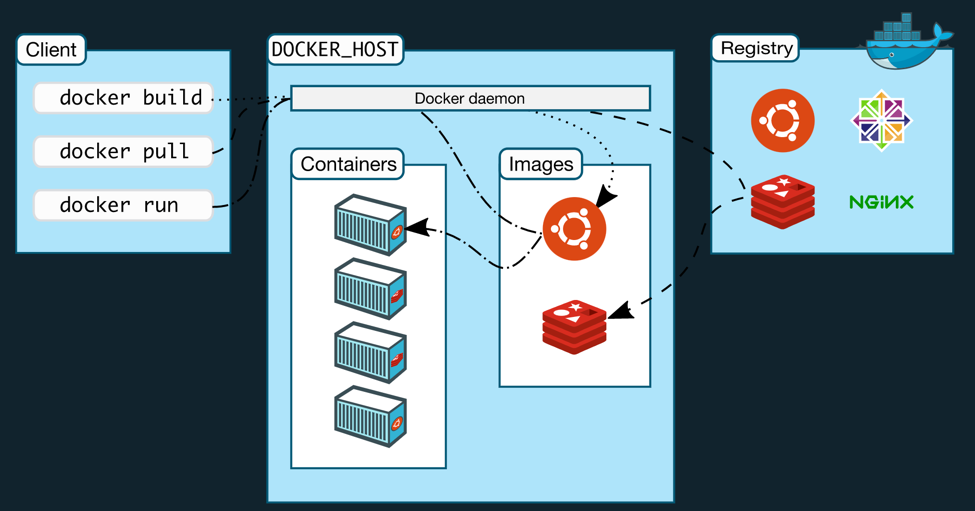

## August 30th 2021

Unix socket -> different from web socket
-> is a data communications endpoint for exchanging data between processes executing on the same host operating system.

My docker client in terminal talks to docker daemon via socket communication.
ll docker-cli.sock
ll docker.sock

