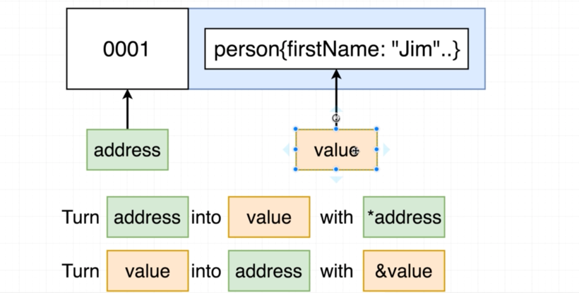
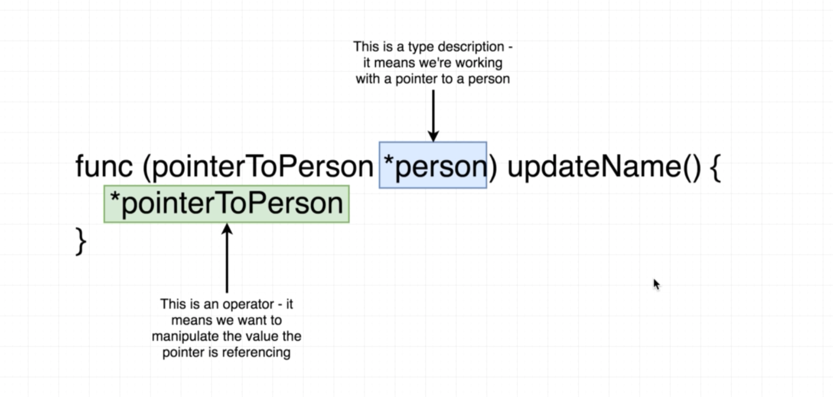
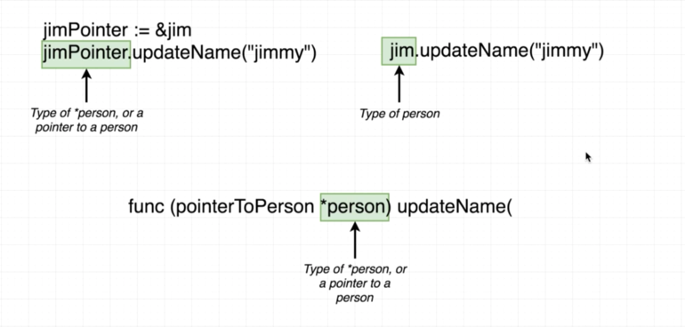
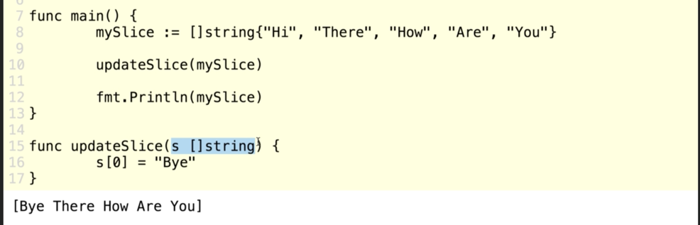
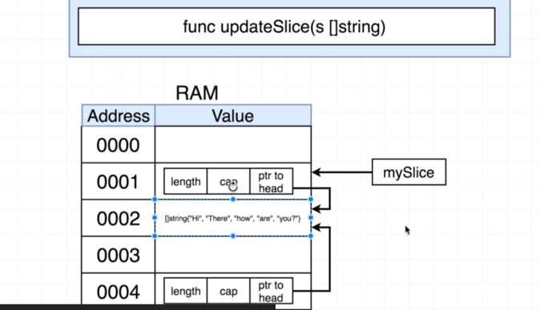
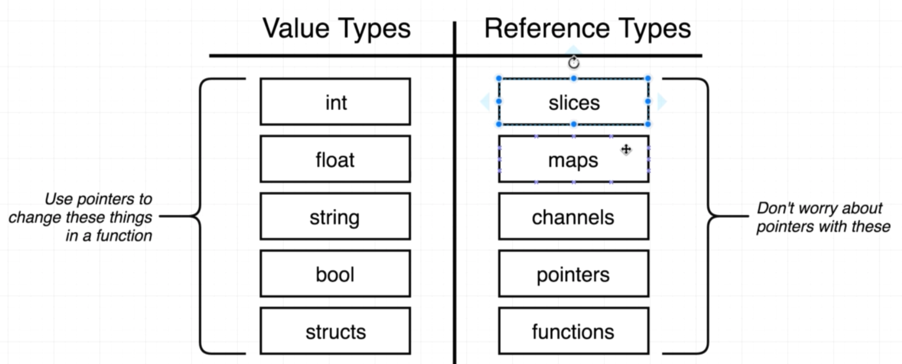

###GO pointers

Address & Value 

-----------------------------------------------------------------------------------

Diff between pointer type declaration & pointer as an operator

-----------------------------------------------------------------------------------

Calling a function that has pointer receiver :
Left (long cut) vs Right (Short cut)

-----------------------------------------------------------------------------------

Gotcha !! 

    Slices are pass by reference.. 
    so even though u dont have a pointer receiver in updateSlice
     -> it ll still update the value

Slice -> is actually maintained like [length,capacity,ptr to head]
When we create a slice, Go will automatically create:
    
    An array and a structure that records the length of slice, 
    the capacity of slice &
    and a reference to the underlying array

so even though - it looks like a copy is made.. we essentially copy the 3 things []. which inherently copies the address to head  

-----------------------------------------------------------------------------------

Value Types V/S Reference Types 

-----------------------------------------------------------------------------------

TRICKYYYY !!!!!!

Do you think the memory address printed by both Println calls will be the same?  Why or why not?

    package main
    
    import "fmt"
    
    func main() {
        name := "bill"
        
        namePointer := &name
        
        fmt.Println(&namePointer)
        printPointer(namePointer)
    }
    
    func printPointer(namePointer *string) {
        fmt.Println(&namePointer)
    }

-> Answer is -> 

The log statement will print different addresses bcoz 

EVERYTHING in go is pass by value !! 

https://github.com/PankhudiB/learning-log/blob/main/go-pointers.go

    func main() {
        name: "bill"
        namePointer := &name
        fmt.Println("A: ", namePointer)
        fmt.Println("B: ", &namePointer) 
        printPoint(namePointer)
    }
    
    func printPointer(namePointer *string) {
        fmt.Println("C: ", namePointer)
        fmt.Println("D: ", &namePointer)
    }

    The output at my computer is
    A:  0xc000010230
    B:  0xc00000e028
    C:  0xc000010230
    D:  0xc00000e038
    
    You could find that A & C have the same result (memory address). But B & D do not.
    Because Go passes the "value" , means the memory address 0xc0000101b0 as a value, to be passed to the printPointer() function, then you get the C is the same value.
    However, namePointer in main() has its own memory address (see B) and namePointer in printPointer() has its own memory address (see D), too. Therefore, you could imagine that they are stored at different memory address actually.
    
    So, to sum up,
    
    A:  0xc000010230   --> value
    B:  0xc00000e028   --> address of A
    C:  0xc000010230   --> value  (Go copy it from A)
    D:  0xc00000e038   --> address of C
