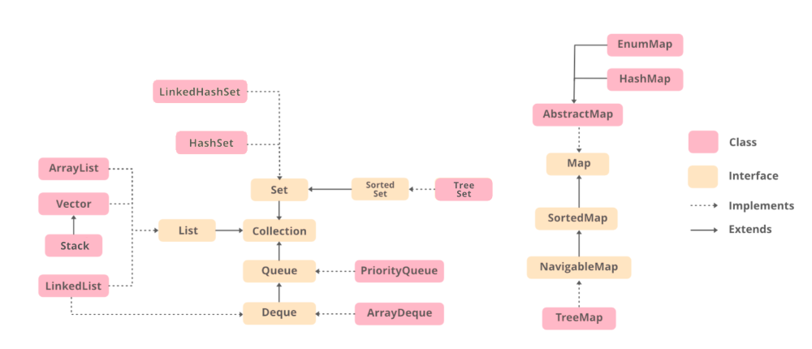
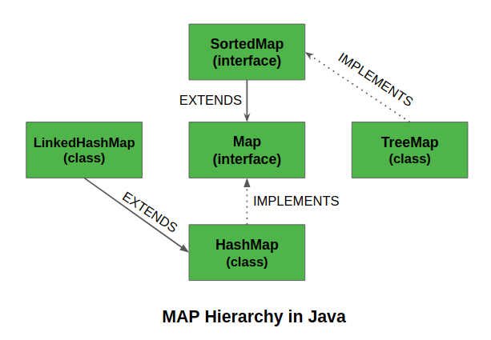

## Revising JAVA
#### Aug 15th 2022

Noting down things I had forgotten about Java 

### Collections
 

--------

- `Vector` is `synchronized` and an `ArrayList` is `non-synchronized`
- `Stack` is a subclass of Vector and a legacy class. 
  - thread-safe which might be overhead in an environment where thread safety is not needed. 
  - `ArrayDequeue` is an alternative.
    - it implements both `Queue` and `
- 

--------
Map hierarchy : 

