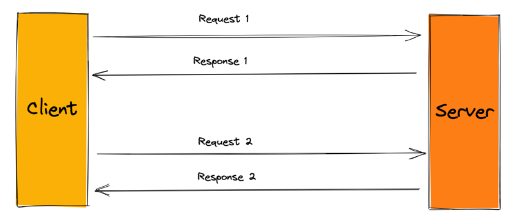
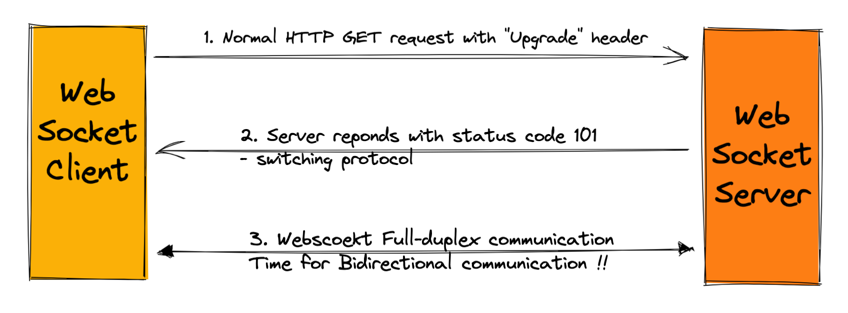

### WebSockets 

1. Before diving into what they are - lets understand why would i need one ?
   1. use cases
2. What
3. How does it avoid doing 3 way handshake multiple times
4. HTTP flow req/res
5. What's a TCP connection
6. compare with HTTP  


WebSocket protocol is not HTTP. It serves a different purpose.
It is an independent application-layer communication protocol also built on top of TCP (or any transport level protocol that caters to requirements of WebSockets application protocol)


Q: What happens when theres an LB in between ?
A: https://stackoverflow.com/questions/15266702/proxying-websockets-with-tcp-load-balancer-without-sticky-sessions/15270860#15270860
If the load balancing happens on DNS basis, then the load balancer is not involved in the final TCP connection at all. It just tells the client to which host is has to connect directly.
If the load balancer works like the Layer 4 ELB from AWS (docs here), then it so to say proxies the TCP connection. So the client would actually see the ELB itself as the server. What happens, however, is that the ELB just forwards the packages in both directions, without change. Hence, it is still heavily involved in the TCP connection, just transparently. In this case there are actually two permanent TCP connections involved: one from you to the ELB, and one from the ELB to the server. These are again permanent for the lifetime of your WebSocket connection.

Q: So you're saying that if the ELB receives packets from client A over TCP, it will automatically forward it to server B over TCP, provided that server B was the server that received the original HTTP Upgrade? How does the ELB know to do this if these are two separate TCP connections? –
A: Okay, I'll try it in other words :-) 1) The AWS Layer 4 ELB proxies incoming new TCP connections to a backend server of its choice. 2) From this moment on and for the lifetime of this TCP connection, the ELB maintains a quasi-direct connection between client and backend server. 3) "quasi-direct" means that the connection is proxied through the ELB. So while the TCP connection is alive, the ELB is fully aware of the two end points taking part (client and backend server).
   you might want to realize the difference between stateful and stateless protocols. While HTTP is a stateless protocol by itself, your question makes a lot of sense -- load balancing for generally independent HTTP requests is a challenge. Keeping the correspondence between one client and one backend server in case of HTTP requires tricks. A TCP connection, however, is stateful and permanent. Keeping the correspondence between client and backend server in case of a TCP connection already happens by definition. If this principle is violated, it's not a TCP connection anymore.

Q: So how exactly is the TCP connection stateful?
A: https://en.wikipedia.org/wiki/Stateless_protocol + Need to dig more

--------
The request response is HTTP format so that servers can handle
HTTP connections as well as WebSocket connections on the same port.
However, the specific fields involved, and what follows after the handshake,
do not conform to the HTTP protocol.

Even RFC 6455 states that WebSocket "is designed to work over HTTP ports 443 and 80 as well as to support HTTP proxies and intermediaries", thus making it compatible with HTTP.

------------------
How to start a WebSockets server in golang ?
1. Different CLIs you can use for WebSockets clients 
   1. websocat 
   2. 
----------------------
   
1. HTTP 
2. HTTP1.1 -> came with 
   1. keep alive header 
   2. Upgrade header
3. HTTP short polling:
   1. AJAX based timer - client keeps sending req at fixed interval
   2. server responds immediately to each req - 
      1. either providing new data 
      2. or sending an ‘empty’ response if there is no new data
   3. not much use in realtime
4. HTTP long polling:
   1. Server holds the connection open until either:
      1. deliver response if new data is available 
      2. OR timeout threshold is reached
5. HTTP Streaming:
   1. Allows a web server to continuously send data to a client over a single HTTP connection that remains open indefinitely

---------------
## Deep dive into WebSockets

Hello there ! In this post, we'll be doing a conceptual deep dive into WebSockets.  

But, before that let's first understand the use case of WebSockets.

In a client-server architecture, if client wants to talk to the server,
it can make an `HTTP request` to the server and the server responds back.

HTTP Request-Response Cycle:


Now if there is a data update that has happened on the server, 
there's no way it can make a real time update to the client - 
unless the client constantly keeps requesting the server. Meh! Bad idea!

What if I tell you - we have a better way to achieve this "Real time updates" - Server being able to push updates to its client ?

Enter, WebSockets! 

### Some real life use cases of WebSockets:

- Sports updates : 
  Well, I am not into Cricket  but when the Indian team plays, my friend surrenders himself to the pace of the game.
    So if you are planning to include sports updates in your application, WebSockets can keep your users up to speed.

- Multiplayer Games:

  Usually multiplayer games have a server that stores the game state. 
  When a player makes a move - it is sent to the server - that updates the game state.
    The updates are instantly relayed to all other players via WebSockets.


- Collaboration apps: 
  Want to build the next draw.io or figma-like collborative tools? You can follow the pattern above to allow users to collaborate and instantly update others.

### Okay, So what are WebSockets anyway?

The Wikipedia definition says :

```
WebSocket is a computer communications protocol, providing full-duplex communication channels over a single TCP connection.
```

Let's try breaking it into 3 pieces :

**"WebSocket is a computer communications protocol..."** -  meaning it has set of rules to allow two or more entities to transmit information.

**"...providing full-duplex communication channels..."** - meaning it enables communication to be bidirectional.

**"...over a single TCP connection."** - and alll of this with just 1 TCP connection - How does it matter you ask ? Well you save a lot of time and resources not creating multiple TCP connections!


### So, how does the WebSockets handshake look like ?



Let's examine how the Req/Res looks:

Client:
```http request
    GET /endpoint HTTP/1.1
    Host: server.example.com
    Upgrade: WebSockets
    Connection : Upgrade 
```

Server:
```
    HTTP/1.1 101 Switching Protocol
    Upgrade: WebSockets
    Connection : Upgrade    
```


Note that WebSockets work with HTTP1.1 and upwards only.
Because it was HTTP 1.1 that introduced Upgrade header.
Refer: [RFC2616](https://www.rfc-editor.org/rfc/rfc2616)


### What's an Upgrade header ? 

The Upgrade header field provides a simple mechanism
for transition from HTTP/1.1 to some other application-layer
protocols upon the existing transport-layer connection.

For example, Upgrade to HTTP/2.0 or IRC/6.9 

You can read more about it here [RFC2616 Upgrade header](https://www.rfc-editor.org/rfc/rfc2616#page-144)
Technically, the client can "indicate a preference" that it wants to upgrade, if possible. 
Whether to upgrade or not is determined by the server.  

Summarising the handshake:

The client tells the server it wants to upgrade the connection to WebSocket.
The server analyses the request and let's say chooses to upgrade it.
To convey that server responds with 101 - switching protocol.
Once the handshake is successful, clients and servers can transfer data back
and forth for indefinite amount of time, until either of them closes the connection.

### How is WebSocket different than HTTP ?
Looking at the request response above, I'll confess WebSockets look very HTTPish to me, and seemingly I wasn't alone.
But let us address that too.

###WebSocket protocol is not HTTP!
Understand that the WebSocket request/response are in HTTP "format". 
But they are still two different application layer protocols. 
Meaning they have there different set of rules, semantics.

Now Why does WebSocket use HTTP "format" for initial request/response handshake ?
Well, the WebSocket Protocol was designed to address the goals of bidirectional communication
while being compatible with the existing HTTP infrastructure like servers, proxies and filtering. Isn't that beautiful!

Hopefully this post helped you understand WebSockets a bit better. Let me know in the comments if you have any questions or feedbacks! Happy Coding! 👩‍💻 
