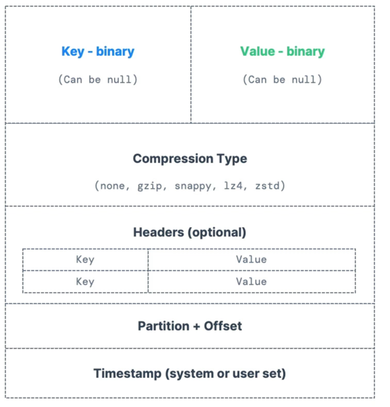

## Confluent Kafka 101 course

https://developer.confluent.io/learn-kafka/apache-kafka

event in kafka 
- modelled as key value pair
- internally both are just []byte - loosely typed
- programming language - not so loosely typed

TOPIC
- Event organization
- particular stream of data
- ~ to table in DB without constraints / data validations
- identified by name
- any kind of message format
- seq of message -> stream
- durable set of append only logs
- Can only be seeked by offset, kafka topics are not indexed
  - CANT query topics
- events are immutable 
  - immutability - makes it simpler for replication
- they are durable
  - can be made to expire

PARTITION 
- Topics are split in partitions
- messages within partition are ordered
- Order is guaranteed ONLY WITHIN PARTITION (NOT ACROSS PARTITION) 
- each message within a partition gets incremental id - called Offset
- Data is assigned randomly to a partition unless a key is provided 
- you can have as many partitions for a topic

PRODUCERS
- Producers write data to topics (which are made of partitions)
- Producers know to which partition to write to (and which Kafka broker has it

- Have message key in the message - optional
- if key = null -> data is split across partition using round-robin
- if key! =null, then all messages for that key will always go to the same partition (hashing)
- • A key are typically sent if you need message ordering for a specific field (ex: truck_id)

MESSAGE :

SERIALIZER:
- Kafka accepts only bytes and sends out bytes

KAFKA MESSAGE KEY HASHING:
- Map key to partition 
- default - murmur2 algo
- targetPartition = Math.abs (Utils.murmur2(keyBytes)) % (numPartitions - 1)

CONSUMERS:
- pull model = pull from broker
- The serialization / deserialization type must not change during a topic lifecycle (create a new topic instead)

CONSUMER GROUP:
- Within a consumer group - only 1 consumer will be assigned to 1 partition
- u can have multiple consumer groups on same topic
- consumer id -> to identify the group

CONSUMER OFFSET
- define consumer offset within consumer group
- consumer group - commits the offset to broker - every once in a while
- to tell kafka - how far the consumer group has successfully

By default, Java Consumers will automatically commit offsets (at least once)
- There are 3 delivery semantics if you choose to commit manually
- At least once (usually preferred)
  - Offsets are committed after the message is processed
  - If the processing goes wrong, the message will be read again
  - This can result in duplicate processing of messages. Make sure your processing is idempotent (i.e. processing again the messages won't impact your systems)
- At most once
  - Offsets are committed as soon as messages are received
  - If the processing goes wrong, some messages will be lost (they won't be read again)
- Exactly once
  - For Kafka => Kafka workflows: use the Transactional API (easy with Kafka Streams API)
  - For Kafka => External System workflows: use an idempotent consumer
    

BROKERS:
- each broker contains certain topic partitions
- as a consumer - u connect to only 1 broker - u'll be automatically be connected to entire cluster
- 
