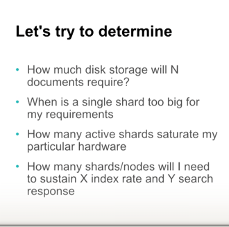
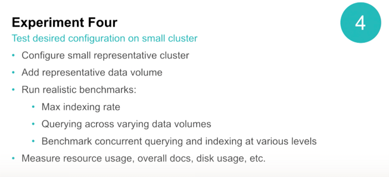

## Elastic Search - Quantitative Cluster Sizing 

## Node, Shards, Index  

1. Node - single running instance of ES - simplicity 1 node per server
2. index - is made of 1 or more shards
3. shards 
   1. primary - write , reindex, delete, read 
   2. replica - high availability, read through
      1. replica shards do as much work as primary 
      2. no of times your document gets indexed == replicas
4. Mapping
   1. how your json data - is 
   2. are we indexing all fields 
   3. are they analysed not analysed
   4. are they all searchable
   5. aggregations ?

1. How big should be 1 shard 
2. How many shards in a single node 
3. How many active ones on 1 node
4. How long do you want the data to be retained 
5. Ratio of index vs searching
6. Continous vs bulk indexing
7. do we have peaks in the load
8. kinds of queries

### Major Questions

### Experiments to figure out answers

------------

plot the indexing rate to query response rate against the shard size -- so you know - beyond this its not performing well

------

1. Did we gain a lot of performance increase in indexing rate while adding shards

-------

