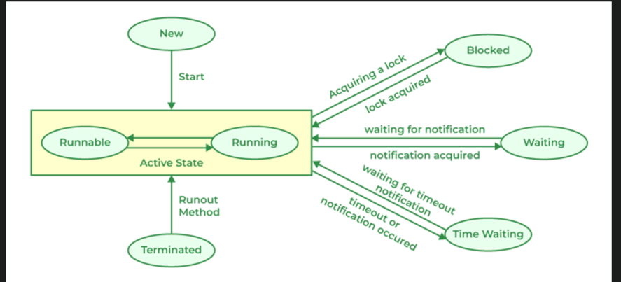

## Java trivia

#### Stubs vs Mocks
2. stubs : 
   1. simple fake object - fake date return
   2. help us simulate data that we want to send back
   3. only has methods require for testing
   4. The purpose of the stub is state verification.	
3. mocks :
   1. Mock help us use stubs that can be asserted to validate a flow
   2. you may assert against a mock object whereas you can’t with a stub. 
   3. The purpose of mock is characteristic verification.

#### Composition vs Inheritance 

Composition - has-a relationship between objects.
Inheritance - is-a relationship between classes. 

Composition - Composing object holds a reference to composed objects and hence relationship is loosely bound.
Inheritance - Derived object carries the base class definition in itself and hence its tightly bound.

Composition - Used in Dependency Injection
Inheritance - Used in Runtime Polymorphism

Composition - Single class objects can be composed within multiple classes.
Inheritance - Single class can only inherit 1 Class.

Composition - Its the relationship between objects.
Inheritance - Its the relationship between classes.

#### Types of Classes
- Final Class
  - final variable - its value persists throughout the program
  - final method - cant be overridden by subclass
  - final class
    - cant have sub classes
    - useful for immutable classes - like String , wrapper classes
    - trivia -> you cannot declare a class both final and abstract. 
- Static Class
  - An object cannot be created for a static class.
  - the static keyword in java can only be used for an inner class 
  - A static inner class may be instantiated without instantiating its outer class,
  - 
- Abstract Class
- Concrete Class
- POJO Class
- Singleton Class
- Inner Class

#### Polymorphism
1. Compile-time Polymorphism
   1. function overloading or --- no operator overloading in java
2. Runtime Polymorphism
   1. method over-riding - also called as virtual function
   2. abstract method - is called pure virtual function

#### Composition vs Aggregation vs Association
Composition - university has dept
Aggregation - dept have professor - if dept closes , prof dont die
Association - is just like you know about the other - eg prof know each other as friends 

#### Threads can be created by using two mechanisms :
1. Extending the Thread class
2. Implementing the Runnable Interface

Thread Lifecycle:
