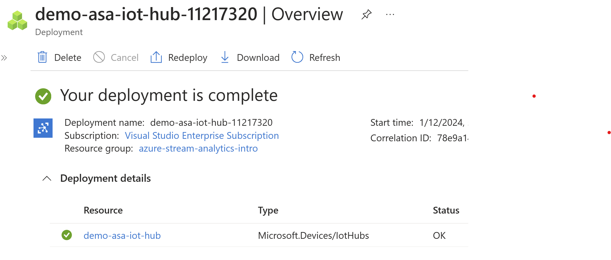

## Azure Stream Analytics

You can analyse your data using SQL
custom function support

How does it work?

1.Define Source (Event Hub, Blob Storage, IoT Hub, etc) + Define Alias
2.Define Output + Define Alias
3.Define Query - Core of how you analyse/process/transform your data
```sql
SELECT *
INTO [output alias] 
FROM [input alias]
```
4.Start Job

As soon as data starts streaming in, it will get filtered(based on the condition) on the fly and sent to the output

SQL query GROUP BY Tumbling Window of XYZ seconds can be done --> 

```
GROUP BY TumblingWindow(second, 10)
```

---------

### HANDS ON


Open Rasberry-pi simulator
https://azure-samples.github.io/raspberry-pi-web-simulator/

Created a IOT Hub on Azure Portal



Create a IOT Device


Copy the connection string and replace it in the simulator

Create an Azure Stream Analytics Job


Create a Storage Account for blob storage


In Azure Stream Analytics Job 

Add an input


Add an output


