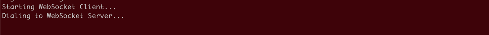

###GO pointers

Address & Value 

-----------------------------------------------------------------------------------

Diff between pointer type declaration & pointer as an operator

-----------------------------------------------------------------------------------

Calling a function that has pointer receiver :
Left (long cut) vs Right (Short cut)

-----------------------------------------------------------------------------------

Gotcha !! 

    Slices are pass by reference.. 
    so even though u dont have a pointer receiver in updateSlice
     -> it ll still update the value
-----------------------------------------------------------------------------------

Value Types V/S Reference Types 

-----------------------------------------------------------------------------------
