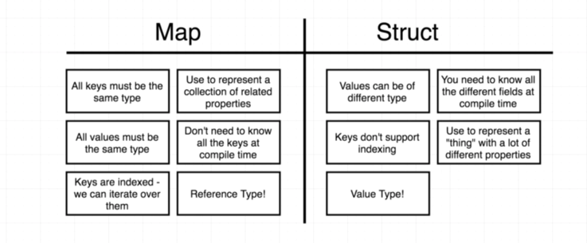
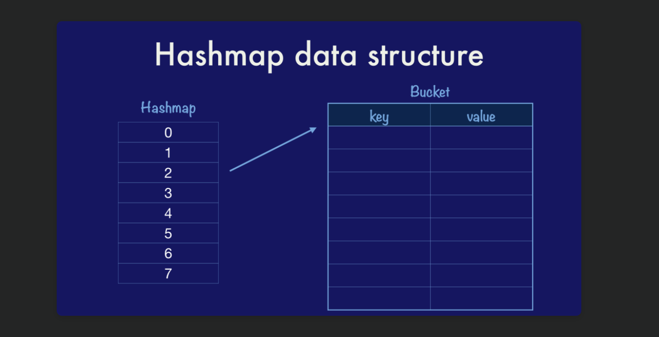

###GO map vs struct

Never thought i would be comparing them.. 
but i randomly came across it...

Go internally uses a hashmap. 

which I believe uses a hash function

A hash function takes a key of an unknown length and returns a value with a fixed length.

`hash(key) → integer`

--------------------------------
`2` imp properties of hash function :

`1. stability ` : Given the same key, your hash function must return the same answer

`2. good distribution` : Given two near identical keys, the result should be wildly different.

Go's implementation looks something like this :

The classical hashmap is an array of buckets each of which contains a pointer to an array of key/value entries.

Hashmap has eight buckets and each bucket can hold up to eight entries each

--------------------------------

Four properties you need to implement a hashmap :

1. You need a `hash function` for the key.
2. You need an `equality function` to compare keys.
3. You need to know the `size of the key` and,
4. You need to know the `size of the value` because these `affect the size of the bucket structure`,
   which the compiler needs to know, as you walk or insert into that structure, how far to advance in memory.

Loved reading this article : 

https://dave.cheney.net/2018/05/29/how-the-go-runtime-implements-maps-efficiently-without-generics#easy-footnote-1-3224

