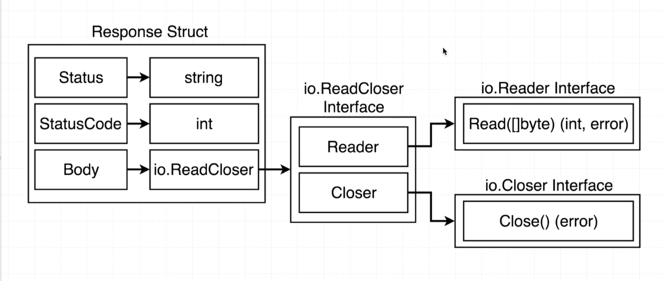

###Interfaces in Go

Interfaces are not generic type -> other languages have generics. go does not.. I think it is intorduced in Go 1.18

Interfaces are implicit. We dont manually have to say that our custom type satisfies some interface.

Interfaces are a contract that helps us manage type. 

