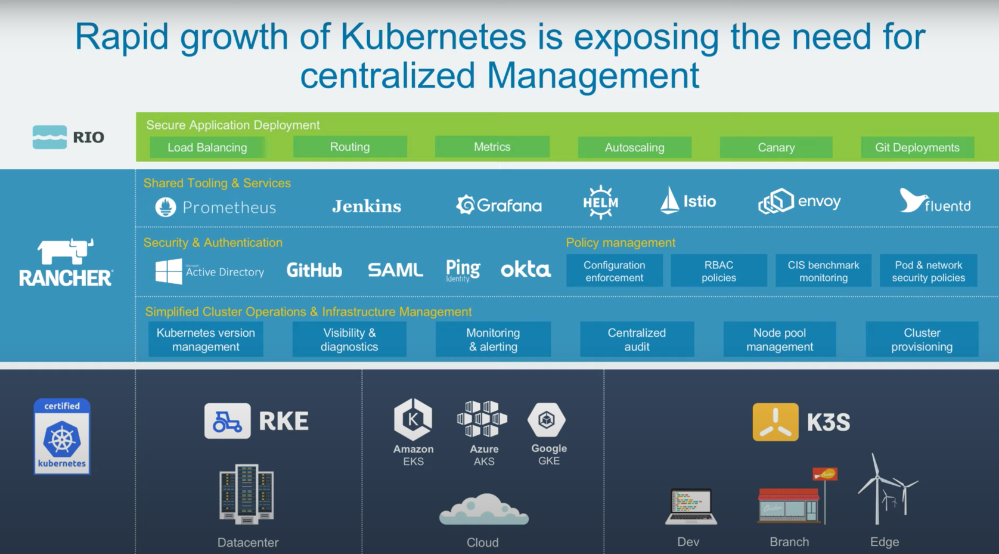

## July 30th 2021

What's required to unleash power of K8s ?
    
    key things for succesful k8s strategy :
    1. Certified k8s distribution
    2. Centralized management 
        - shared tools and services
        - security , policy and user mgmt
        - consistent cluster operation

    - Certified k8s distribution : 
        - RKE 
            -> takes all of k8s and runs it inside Docker container
            -> So all u need is a host with supported version of docker + basic config

        - k3s
            -> lightweight distribution of k8s 
            -> runs all k8s components in 512 MB RAM
            -> good for resource constrained env -> IoT || Edge

        - Cloud provider distribution
            -> runs control plain for u, u only manage k8s 

