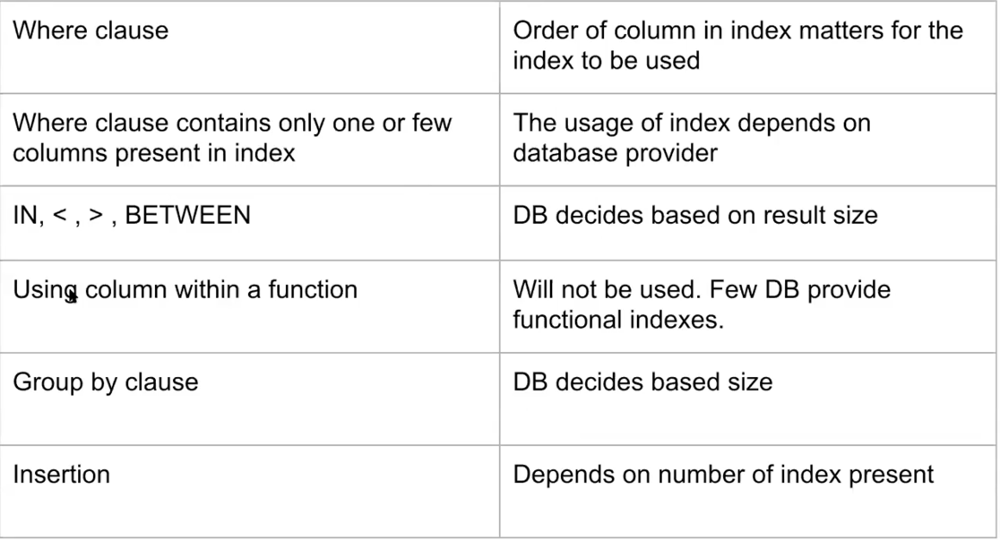

## August 21st 2021

    DB Index

* helps in

  -> improving performance of queries

  -> reducing disk i/o operation on disk

  -> sorting

  -> uniqueness of data

* Cons:

  -> disc space to store the index

  -> write query becomes costly | i.e. i need to add data to main table + taking care of index

  -> a bad index can cause more harm than good

    DS used in index

* B-treee -> default index
* hash index -> for equality operators | or when we know coln value is going to be unique
* gin index -> for composite datatypes like json
* brin -> when we know we want to work on range of values

    B-tree for indexing

* Read operation needs to be fast
* now with this ds -> searching is faster
* and if data has to be read -> all last leaf nodes can sequentially be traversed bcoz of pointers maintained shown in
  fig.

    explain analyze -> in postgress 
     -> good way to analyse -> time taken by query | ## of rows scanned | which index is used 

    * Every primary key has an index

Example

    City table
    country_code | name | district | population | 

    Query : select * from city where country_code = 'NLD';

If we create index on 1 column country_code -> cost will come down

lets say we want to add few more coln to where

    Query : select * from city where country_code = 'NLD' and name='xyz' and district = 'holand';

time will be less -> bcoz It ll use the country_code index

Now what if we know we need the other 2 coln frequently -> and create index something like :

    create index on city (country_code,name,district);

now if u query
    
    Query : select * from city where country_code = 'NLD' and name='xyz' and district = 'holand';

it will use the composite index

now even if u remove district where clause from query -> it ll still use the composite index bcoz we have other 2 coln

If we change the query to just have name || name & district [bcoz i know country code is not really necessary]

    Query : select * from city where name='xyz' and district = 'holand';

it won't do an indexed scan -> rather a sequential scan --> bcoz we have 2 indexes : 1.country_code & 2.(country_code,name,district)
and the primary coln present in both the indexes is not present in your where clause

composite index will something like 
rows with country_code in alphabetical lets say | then name | then district
so its not useful here when country_code is not present in where clause
----------------------------------------------------------------------------------------------------------------
    Indexes and Inbuilt function 
if u do

    Query : explain analyze select * from city where id = 1;
it ll do indexed scan 

lets say we want to query in odd primary_key id wise cities. so if u do 

    Query : explain analyze select * from city where mod(id,2) = 1;

db does a sequential scan :O :O despite having index on id 
--> this is a problem in most db -> when u put coln inside functions (like year,month,mod..)
--> why -> the query does not know it has to use the index

-> create a temporary coln and save the result of mod(id,2)
-> postgress allows u to create an index of a function
  
    eg: create index on city (mod(id));

-> or u can also try and not use the inbuilt function

----------------------------------------------------------------------------------------------------------------
    
  Index and Min and Max function

    select min(population) from city;

without index -> seq scan | with index on population -> indexed scan

Now if query is something which has huge range eg :
    
    select * from city where population > 200 and population < 10500000

db optimizer will do sequential scan | there is nothing wrong with query nor with index. -> more benefitial here  
since the range was huge -> it deduced that i have to fetch a lot of rows and it would be costly to do indexed scan (involving fetching index and then corresponding rows)
sequential scan will need lesser I/O performed

To verify this you can give smaller range || you can actually diable sequential scan by 
    
    set enable_seqscan=false;
----------------------------------------------------------------------------------------------------------------

    Group by 

DB decides based on size of table

----------------------------------------------------------------------------------------------------------------
    Index dont work on expressions --> like '%xyz%'; despite having index on that column
----------------------------------------------------------------------------------------------------------------

    Negative Impact of indexes

  check by using insert query before and after indexes   

  
----------------------------------------------------------------------------------------------------------------
    
    In a nutshell :

----------------------------------------------------------------------------------------------------------------

    If there is lot of read operations in application --> leverage a lot of indexing 
    If there is lot of write operations in application --> make sure to use optimum -> bcoz insertion cost would be high with indexes

----------------------------------------------------------------------------------------------------------------
