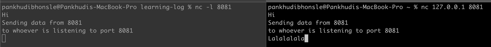

## August 29th 2021

NC | Netcat
    
    Came across this command while checking if port opening has been done with org network 

    Netcat (or nc ) is a command-line utility that reads and writes data across network connections, using the TCP or UDP protocols
    
    nc -l -> will listen to port specified        | nc 127.0.0.1 8081 will write data to this ip and port 

